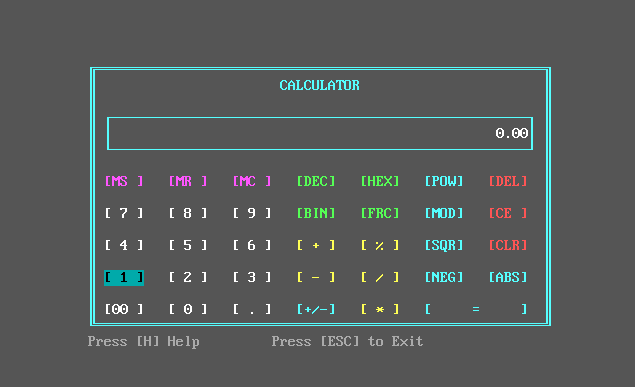
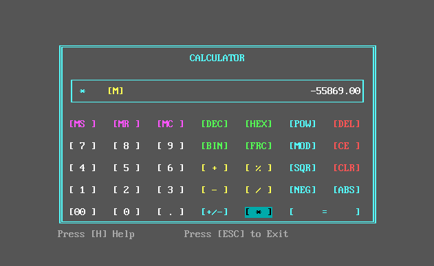
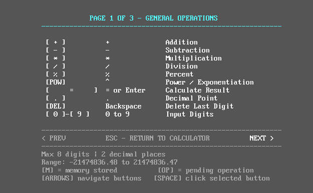

# 8086 Assembly Calculator (`calc.asm`)

> *"Just a calculator built in 8086 Assembly. Why? Because writing normal code wasn't painful enough. 😅"*

A fully functional, multi-digit calculator written entirely in 16-bit 8086 Assembly language. 

## 🎓 The Backstory
In college, we were taught 8085 and 8086 programming and processor architecture in a subject called **Microprocessor and Interfacing Techniques (MIT)**. I absolutely loved the subject and the sheer, raw power of controlling the hardware at a low level. So, naturally, I decided I *had* to build a real, working project in assembly instead of just doing simple lab exercises. This calculator is the result!

## ✨ Features (What it actually does)
*   **Basic Arithmetic & Beyond:** Addition, Subtraction, Multiplication, Division, Modulo (`MOD`), Power (`POW`), and Square Root (`SQR`).
*   **Multi-digit Support:** Because calculating single digits is for cowards! This beast handles large numbers smoothly.
*   **Base Conversions:** Convert numbers to HEX and BINary on the fly. It even calculates fractional hex and binary! (e.g., `10.50` in binary becomes `1010.1`).
*   **Memory Operations:** Fully supports Memory Store (`MS`), Memory Recall (`MR`), and Memory Clear (`MC`).
*   **Robust Error Handling:** Built-in overflow and divide-by-zero detection! If numbers get too big, it'll tell you instead of crashing the universe.
*   **Custom UI Navigation:** Hand-drawn interface in 80x25 text mode using custom 2D grid indexing, letting you navigate the buttons using your keyboard arrow keys!
*   **Keyboard Shortcuts:** You can type digits normally, use `C` to clear, `E` to clear entry, `H` for help, and arrow keys to navigate the UI seamlessly.

## 🤓 Technical Deep Dive
For the nerds out there, here is how it actually works under the hood:
*   **32-Bit Support on a 16-Bit Chip:** The 8086 only has 16-bit registers, meaning the biggest number it natively understands is `65,535`. To calculate larger numbers, this calculator chains two 16-bit registers together (a high word and a low word) to achieve true 32-bit math! This expands the limit to over `2.14` Billion.
*   **Fixed-Point Decimal Math:** The 8086 doesn't have native floating-point math (no FPU). So how does it handle decimals? It uses fixed-point arithmetic! Every number is internally multiplied by `100`. So, `1.50` is actually calculated as `150` under the hood, and the decimal point is artificially inserted when rendering to the screen.
*   **Custom Algorithms:** Because it's purely integer-based, operations like Multiplication, Division, and Square Root (`SQR`) don't have magic instructions for big numbers. They are implemented from scratch using custom 64-iteration shift-and-subtract routines, and digit-by-digit base-4 integer square root algorithms.

---

## 📸 A Visual Tour

Instead of a boring list, here's what it looks like to actually use it:

### 1. The Welcome Screen
This is where the magic begins. A nice, clean interface welcoming you to the 16-bit era.


### 2. Doing the Math
Handling large, multi-digit numbers smoothly. 


### 3. When Things Go Wrong (Error Handling)
We don't do silent failures here! Here's what happens when you trigger an overflow or an invalid input.


### 4. The Help Menu
In case you somehow forget how to use a calculator.


---

## 🚀 How to Run It

To run this, you'll need an MS-DOS environment (like [DOSBox](https://www.dosbox.com/)) and an assembler like TASM (Turbo Assembler).

1. Mount your directory in DOSBox and navigate to it.
2. Assemble the code:
   ```bat
   tasm calc.asm
   ```
3. Link the object file:
   ```bat
   tlink calc.obj
   ```
4. Run the executable and enjoy the nostalgia:
   ```bat
   calc.exe
   ```

## 🛠️ Built With
*   **Language:** 8086 Assembly
*   **Assembler:** TASM (Turbo Assembler)
*   **Blood, Sweat, and Registers:** `AX`, `BX`, `CX`, `DX` (and friends)